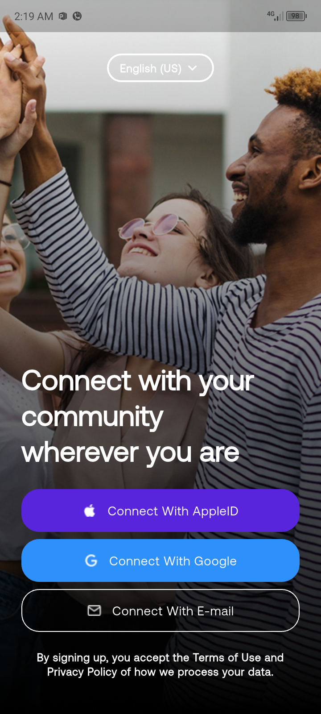
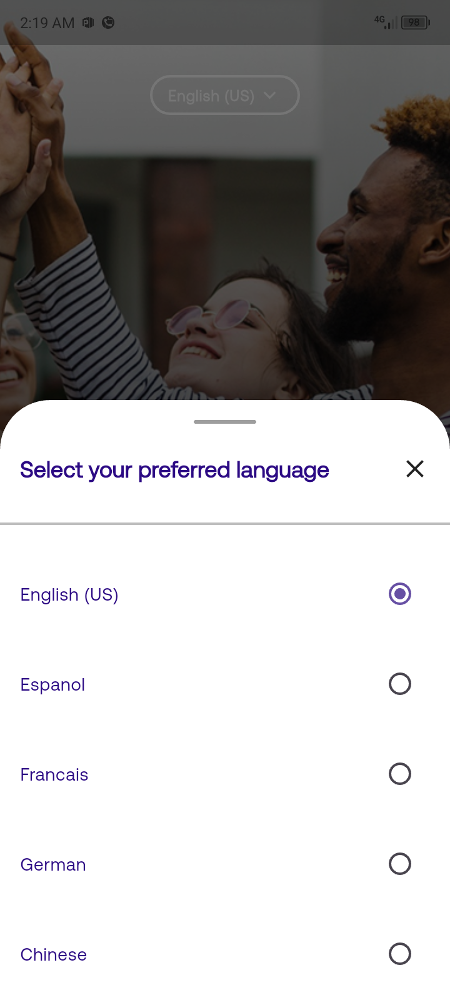

# flutter_coding_task

This is a test prroject to show UI fidelity and flutter fundamentals.

## screenshots
-The onboarding screen with a pop up bottom modal sheet to select a language

<p>

   
</p>

## Steps
1. I reviewed the figma project to understand the concept of the design
2. I copied text strings, radii size and widget dimensions from Figma to my clipboard
3. I downloaded all relevant images and assets
4. I created a new flutter project and named it flutter_test_project
5. created a dart theme file and dart thext theme file and used it in my app.dart file
6. Created a custom responsive dart file that scales widget dimensions and text size with respect to screen size
7. I integrated the responsive helper class with my onboarding screen and adjusted the dimension of widgets as well as text to reponsive sizes.
8. I built the apk file after successfull completion of the design

   
## Getting Started

Prerequisites
Before you begin, ensure you have the following installed:

Flutter SDK

Dart SDK

Android Studio or VS Code (with Flutter and Dart plugins)

A connected device or emulator for testing

Getting Started
1. Clone the repository
```
   git clone https://github.com/ahmvddddd/flutter_test_project.git
```
Navigate to the project directory:
```
cd flutter_test_project
```

2. Install dependencies
Run the following command to fetch all the packages:
```
flutter pub get
```

3. Run the app
Make sure a device or emulator is running, then execute:
```
flutter run
```

4. Build APK (Android)
To build a release APK:
```
flutter build apk
```
Build for iOS (MacOS only)
To build the app for iOS:
```
flutter build ios
```

5. Troubleshooting
Run flutter doctor to check for setup issues:
```
flutter doctor

```
To clean the build:
```
flutter clean
flutter pub get
```
